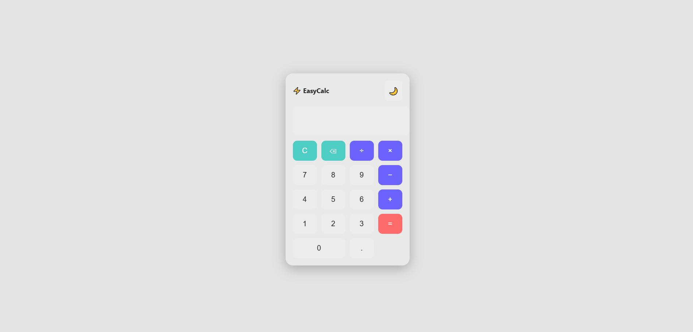
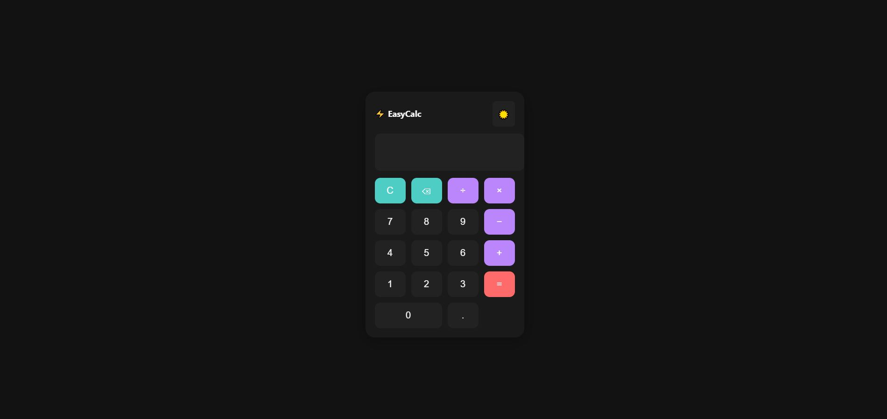

# ⚡ EasyCalculator

A modern **Calculator App** built with pure **HTML, CSS, and JavaScript** — no frameworks, no libraries.  
It features a clean **glassmorphism UI**, smooth animations, and a **Dark/Light mode toggle**.




---

## ✨ Features
- ✅ Basic operations: `+ - × ÷`
- ✅ Clear (`C`) and Backspace (`⌫`) functions
- ✅ Decimal support
- ✅ **Dark / Light mode toggle** 🌙☀️
- ✅ Responsive and minimal UI
- ✅ Glassmorphism design with hover/active animations

---

## 📂 Project Structure
```text
calculator/
│── index.html # Main HTML file
│── style.css # Styling (light/dark mode included)
│── script.js # Calculator logic